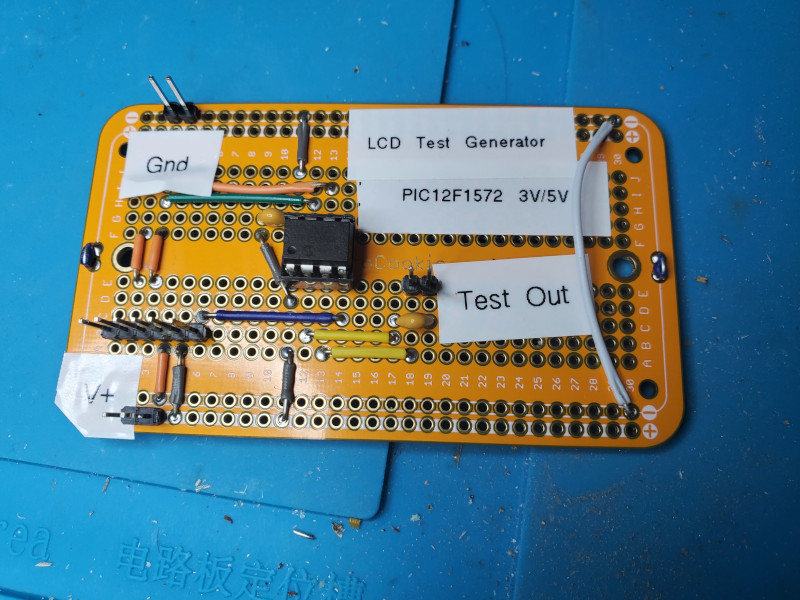

# The LCD Test Generator

The LCD test generator produces a 250Hz AC square wave suitable for testing pairs of LCD common and segment pins.
It is built from a minimum of parts, all suitable for breadboarding and manual soldering.

Two versions of the test generator circuit and firmware are provided
* based on Microchip PICLF19156, the same 28-pin MCU used in the LCD Demonstration, operates only at 3V for testing 3V LCDs
* based on the Microchip PIC12F1572, a smaller and cheaper 8-pin MCU, operates at 3V or 5V for testing 3V or 5V LCDs; this version may be preferable if you want to solder up a permanent version

Look at the following files for description of the PIC16LF19156-based test generator:
* PDF of circuit schematic at [Schematic_LCD_Test_Generator.pdf](Schematic_LCD_Test_Generator.pdf)
* KiCad project for customizing the circuit at [kicad/LCD_Test_Generator](kicad/LCD_Test_Generator)
* MPLAB X IDE project containing source code for firmware at [mplabx/LCD_Test_Generator.X](mplabx/LCD_Test_Generator.X)

Look at the following files for description of the PIC12F1572-based test generator:
* PDF of circuit schematic at [Schematic_LCD_Test_Generator_PIC12F1572.pdf](Schematic_LCD_Test_Generator_PIC12F1572.pdf)
* KiCad project for customizing the circuit at [kicad/LCD_Test_Generator_PIC12F1572](kicad/LCD_Test_Generator_PIC12F1572)
* MPLAB X IDE project containing source code for firmware at [mplabx/LCD_Test_Generator_PIC12F1572.X](mplabx/LCD_Test_Generator_PIC12F1572.X)

## About LCDs

A pixel (displayable element of any shape, not necessarily a dot)
can be displayed on an LCD glass ("glass" refers to the bare LCD display without any driver circuitry)
by providing a pure AC waveform (a square wave is just fine) across a common (COM) and segment (SEG) pin or lead.
"Pure AC waveform" means here that there must be no DC component to the wave. The areas of the waveform above and below 0V must be of equal area. For example, a not quite square AC-seeming wave that varies between +3V/-3V peak-to-peak but has a duty cycle of 25% has a DC component to it since it spends more time at negative voltage than positive.

Each COM-SEG pair controls at most one pixel,
even though that pixel can be a complex shape that doesn't look like a single display element).
It is possible that some COM-SEG pair control no pixels.

## The generators

### delay loop generator

The test generator here uses a PIC MCU to generate an AC square wave with peak-to-peak voltage approximately twice the PIC supply voltage.
You would run the circuit from a 3V source to test 3V LCDs and from a 5V source to test 5V LCDs.
The technique is to use 2 output pins to provide complementary DC square waves.
The voltage across these pins will yield a net peak-to-peak voltage approximately twice Vdd.
A series capacitor is used to block any accidental DC bias.

Each of the two test generator circuits provided here uses a different PIC MCU:
* PICLF19156, which was selected for the original thermometer project, and will be used for the LCD module demonstration
* PIC12F1572, which is only 8-pin, cheaper than the PIC above, and can operate between 2.4V and 5.5

The firmware is trivial. All initialization code is generated. The main function is:
```C
void main(void)
{
    // initialize the device
    SYSTEM_Initialize();

    while (1)
    {
        // Generate two complementary 250Hz DC square waves
        SIGOUTA_SetHigh();
        SIGOUTB_SetLow();
        __delay_ms(2);
        SIGOUTA_SetLow();
        SIGOUTB_SetHigh();
        __delay_ms(2);
    }
}
```

`SIGOUTA` and `SIGOUTB` are aliases for the specific MCU pins being used.

This yields two complementary DC square waves varying between approximately ground and Vdd,
each with a period of about 4ms,
or a frequency of about 250Hz.
Since an internal oscillator is used as the instruction clock,
with no external crystal to precisely control the timing,
the exact frequency of the square waves will likely vary from 250Hz, but not enough to matter.
The waveform across these pins is an AC square wave with peak-to-peak voltage of about twice Vdd.
A series capacitor in the path from one of the MCU pins (it doesn't matter which one)
blocks any accidental DC current flow.

To test the LCD, connect one MCU output to a COM pin on the LCD and the other output to a SEG pin.
It doesn't matter which output is connected to COM and which to SEG,
but ensure the series capacitor is in the loop. If the tester and LCD are working, a pixel should be displayed.

The technique can also be used to methodically connect pairs of an unknown LCD to map out what pixels display.
With a little thought, is should be possible to determine which are the COMs and which are the SEGs.

### PWM generator

Another test generator approach is to use two pulse width modulation (PWM) modules
of the PIC to produce the two complementary DC square waves.
This firmware does all of its work in seting up and starting the two PWM modules.
After starting, the firmware needs do nothing else and sleeps.
The PIC12F1572's high-frequency internal oscillator (HFINTOSC)
is used as the clock source for the PWM modules;
this allows the PWM modules to continue operating even if the CPU is put to sleep.

In the current program for this, the PWM_FREQ variable can be set with the desired square wave freqency.
Since the HFINTOSC of the PIC12F1572 is factory calibrated,
the square wave frequency shouldbe accurate to within 1%.
