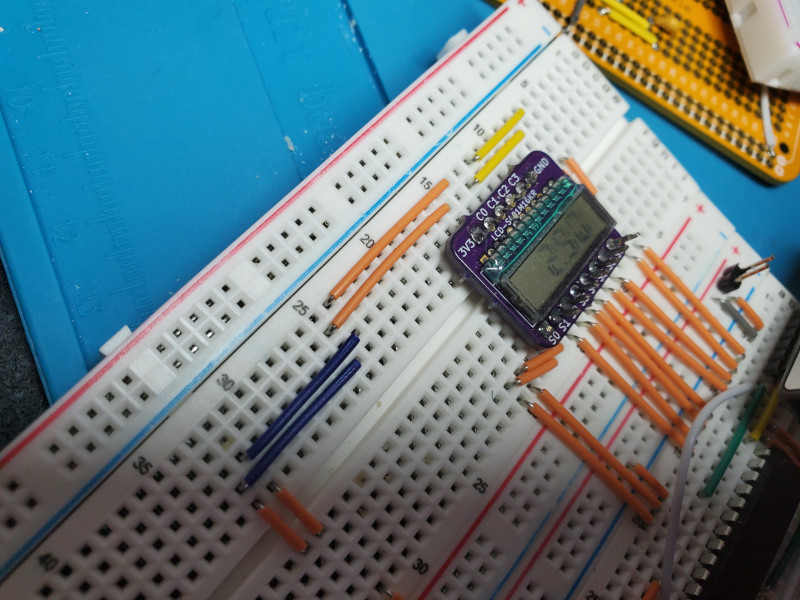

# pic-lcd-demo

Demonstration of driving a multiplexed LCD segment display using the LCD driver module of a PIC16LF19156 MCU.
Includes two versions of another PIC-based circuit, a poor person's AC square wave generator to use to test an LCD segment display.

# Contents

There are two circuits with firmware in this project:
* a [demonstration of driving an LCD segment display](LCD_Demo.md) with a PIC16LF19156 MCU, which has a built-in LCD driver module
* three versions of an [AC square wave generator](LCD_Test_Generator.md) adequate for testing a bare LCD
  * one using the same PICLF19156 MCU
  * one using a smaller, cheaper PIC12F1572 MCU that generates the square wave using software
  * one using a PIC12F1572 MCU that generates the square wave using built-in pulse width modulation (PWM) circuitry
  
Both PIC12F1572 versions run on the same circuit, just with different firmware.

There are two directories at this level:
* [kicad](kicad) - KiCad projects for schematics
* [mplabx](mplabx) - MPLAB X IDE projects for PIC microcontroller firmware, written in C

# Introduction

In 2020, I helped a non-profit design a non-contact IR fever thermometer,
the kind where you point it at a forehead and press a button or pull a trigger to take a temperature.
At the time, the non-profit expected there would become a shortage of these thermometers.
Several design proposals were submitted, including by me.

My proposal, which was not selected, had two characteristics making it different from the others.
I specified a Microchip PIC MCU and an LCD display; the others specified Arduino-compatible MCUs and LED displays.
I picked an LCD for low power consumption and high visibility in normal to bright lighting, such as at a well-lit business or even sunlight.
I selected a model of PIC that had a built-in LCD driver module.

In the aftermath of the thermometer effort,
I decided to build a working prototype of my design,
and this project was a stepping stone to getting there.
I decided to document this stepping stone
because I could find precious little on the internet
about programming the Microchip PIC built-in LCD driver module.

LCD displays are much more complicated to drive than LED displays,
because LCDs are driven by AC signals only.
LCDs are damaged if a long-term DC bias is applied to them.
Microchip simplifies LCD circuit design by building into some of their PIC MCU models
LCD driver circuits that produce suitable AC waveforms.
The PIC LCD module in some PICs also provides a regulated charge pump that can be used for LCD bias,
but that will not be demonstrated here.
The regulated charge pump is both step-up and step-down.

This project demonstrates a minimal circuit and firmware
driving a 3V, multiplexed, 12-pin, LCD segment display (Lumex LCD-S401M16KR)
with a 28-pin DIP Microchip PIC16LF19156 MCU operating at about 3V.

There are two separate but related circuits in the project:
1. Two versions of a circuit and firmware for a poor-person's 3V AC square wave generator to use for testing bare LCD displays
2. A circuit and firmware to show something on the LCD display

# About the Hardware

Schematics and KiCad projects for all circuits are provided.
KiCad is a FOSS design tool for circuits and printed circuit boards.

All the circuits in this project can be easily breadboarded.

## Microcontroller

I chose a PICLF19156-I/SP MCU
([datasheet](https://ww1.microchip.com/downloads/en/DeviceDoc/PIC16LF19155-56-75-76-85-86-Data-Sheet-40001923B.pdf))
for my non-contact thermometer design for several reasons:
* 28-pin SPDIP package is breadboardable and hand solderable
* lowest adequate pin count and footprint of a PIC that has a built-in LCD driver module
* able to directly operate off 3V provided by 2xAA cells or 1xAA cell with a boost converter
* has I2C/IIC/SMBus interface for eventually communicating with a Melexis MLX90614 IR temperature sensor

It is both narrower and smaller than the 40-pin DIP PIC16F19176
([datasheet](https://ww1.microchip.com/downloads/en/DeviceDoc/PIC16LF19155-56-75-76-85-86-Data-Sheet-40001923B.pdf))
that I originally considered.
The LF chips are also lower-power than the F chips,
operating at 1.8V-3.6V, compared to 2.4V-5.5V for the F chips.
You can also use to PIC16F19156 (note the F instead of LF)
to have the flexibility to operate at 3V or 5V.
The PIC(L)F19175/6
([datasheet](https://ww1.microchip.com/downloads/en/DeviceDoc/PIC16LF19155-56-75-76-85-86-Data-Sheet-40001923B.pdf))
would work with minor changes to circuits and firmware.
If you use a different LCD, it may be static (unmultiplexed);
if so, you may need to use a surface mount PIC with more pins,
such as PIC16(L)F19185/6 (44-pin) or PIC16(L)F19195/6/7 (64-pin).

The hardware design is as minimal as I could make it.
The PIC's internal oscillators are used, eliminating the need for external crystals.
The design is low-power, with the optional LED being the biggest current draw.
There are enough spare pins on the PIC16(L)F19156 for a couple of switches and an I2C/IIC/SMBus interface, which were needed in the thermometer project.

The circuits include a 5-pin header for programming in-circuit with a PIC ICSP programmer.
I used a [Pickit 4](https://www.microchip.com/developmenttools/ProductDetails/PG164140) programmer/debugger;
there may be cheaper alternatives, such as the older
[PicKit 3](https://www.amazon.com/Microchip-Programmer-Debugger-Emulator-Controller/dp/B07WS5JL3Z).

I also implemented the square wave generator using
an 8-pin, very inexpensive ($0.80 quantity one) PIC12F1572-I/P
([datasheet](https://ww1.microchip.com/downloads/en/DeviceDoc/40001723D.pdf)),
which will operate at 2.4V-5.5V,
making it suitable for testing either 3V or 5V LCDs.
That circuit and firmware are also provided.

## LCD Display

LCD displays require much less current to operate (microamps)
than LED displays (milliamps).

The display I chose for the my thermometer project was a Lumex LCD-S401M16KR
([datasheet](https://www.lumex.com/datasheet/LCD-S401M16KR))
available cheaply (<$2 quantity 1) from Digikey and Mouser.
It is a 4-digit, 7-segment display
with 3 decimal points and a colon
operating at 3VAC.
It is 4-way multiplexed,
allowing a 28- or 40-pin MCU to be adequate since only 12 pins
(4 common, 8 segment)
are needed to drive the 32 (4*8 = 32) pixels of the display.
This is the LCD that will be used here.

Similar static (unmultiplexed) displays would likely require an SMT MCU
such as the PIC16(L)F19185/6 (44-pin) or PIC16(L)F19195/6/7 (64-pin).

The lead pitch of the LCD is small, only 1.5mm.
I believe the long leads can be spread wide enough to plug into a breadboard,
but I had difficulty doing so and instead ordered a short run of [the only breakout board I could find compatible with this device](https://oshpark.com/shared_projects/sJmRuwZJ).

# About the Firmware 

The firmware for all circuits is in C, using the free Microchip MPLAB X IDE and XC8 compiler.
I flashed my software using the Microchip PicKit 4 programmer and debugger.
There may be cheaper alternatives,
but I'm still too new to PICs to recommend anything other than the PicKit 4
(or PicKit 3, which is older and cheaper).

The full MPLAB X projects for the firmware are provided.

